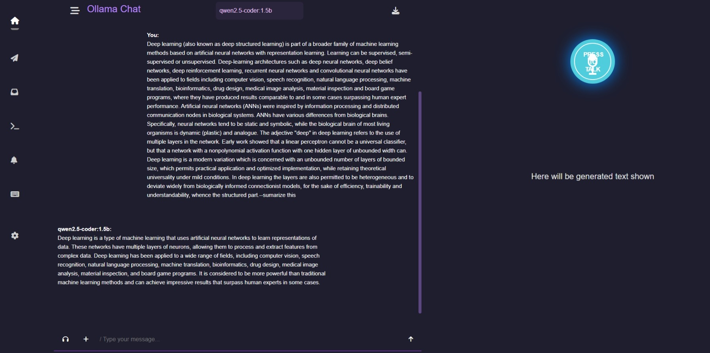
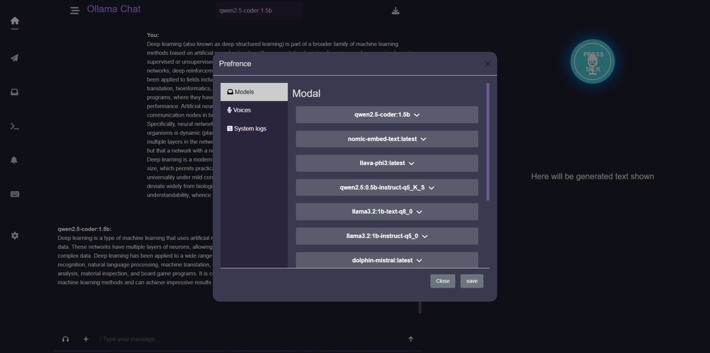
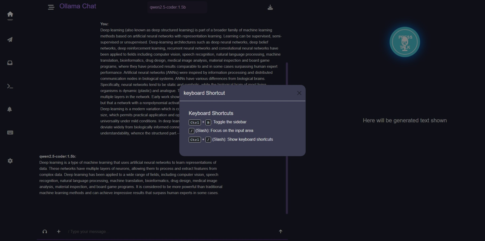

#  ✨💻Ollama Web💡🤝

Ollama Web is a web-based interface for interacting with the Ollama model. This README will guide you through setting up and running the project on both Windows and Linux systems.
## 📷 Preview

Take a quick look at the Ollama Web interface:

### Images
Below are some snapshots of the interface:

1. **Chat UI**  
   

2. **Models page**  
   

3. **other**  
   

<!-- ### Demo Video
Watch a short video demo showcasing the main features of Ollama Web:  
[](others/demo.mp4)  
*(Click on the image to view the video.)* -->

---
## Prerequisites

Before running the project, you need to download and set up **Ollama** on your system.


### 1. 🔽 Download and Install Ollama

### For Windows Users:
1. Visit the [Ollama download page](https://ollama.com/download) for Windows.
2. Download the Windows installer and run it.
3. Follow the installation instructions to complete the process.

### For Linux Users:
1. Open your terminal and run the following command to install Ollama:

   ```bash
   curl -fsSL https://ollama.com/install.sh | bash
   ```

2. After installation, verify that Ollama is installed successfully by running:

   ```bash
   ollama --version
   ```


### 2. 🧷 Clone the Repository

To get the code, you need to clone the `ollama-web` repository from GitHub. Use the following command to clone the repository:

```bash
git clone https://github.com/shekharP1536/ollama-web.git
cd ollama-web
```
### 3. 📥 Install Required Python Packages

Once Ollama is installed, you need to install the necessary Python packages to run the project.

1. Create a virtual environment (optional but recommended) to keep dependencies isolated:

   ```bash
   python3 -m venv venv
   ```

2. Activate the virtual environment:

   - **On Windows:**
     ```bash
     .\venv\Scripts\activate
     ```

   - **On Linux/Mac:**
     ```bash
     source venv/bin/activate
     ```

3. Install the required Python packages:

   ```bash
   pip install -r requirements.txt
   ```

### 4. 🚀 Run the Application

After cloning the repository, navigate to the project directory and run the `index.py` script to start the web application:

```bash
python index.py
```

### 5. 🌐 Access the Application

Once the application is running, open your web browser and go to:

```
http://localhost:5000
```

This will open the Ollama Web interface, and you can start using it locally!

---

## 🛠️ Troubleshooting

- Ensure that you've followed all the installation steps for your operating system (Windows or Linux).
- Verify that Python and all required dependencies are installed correctly by running `pip install -r requirements.txt`.
- If you encounter any issues with Ollama, try restarting your system or checking the [Ollama documentation](https://ollama.com/docs) for more help.

---

Enjoy using Ollama Web! If you have any questions or need assistance, feel free to open an issue on the [GitHub repository](https://github.com/shekharP1536/ollama-web).

## 📬 Contact

If you have any questions or need assistance, feel free to reach out:

- 📧 **Email:** [mywork1536@gmail.com](mailto:mywork1536@gmail.com)
- 🔗 **LinkedIn:** [Shekhar](https://www.linkedin.com/in/chandrashekhar-pachlore/)
